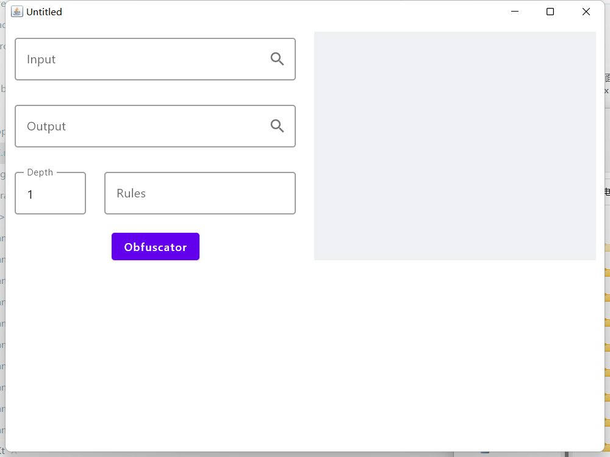
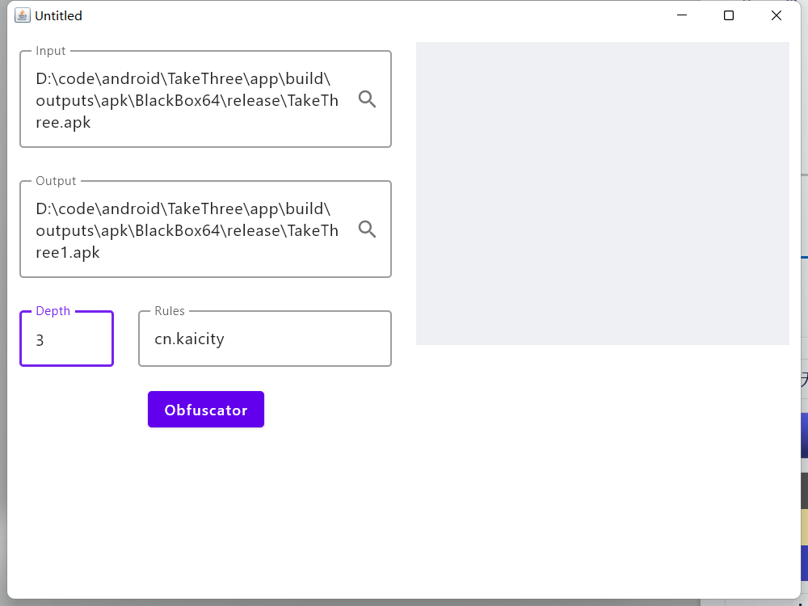
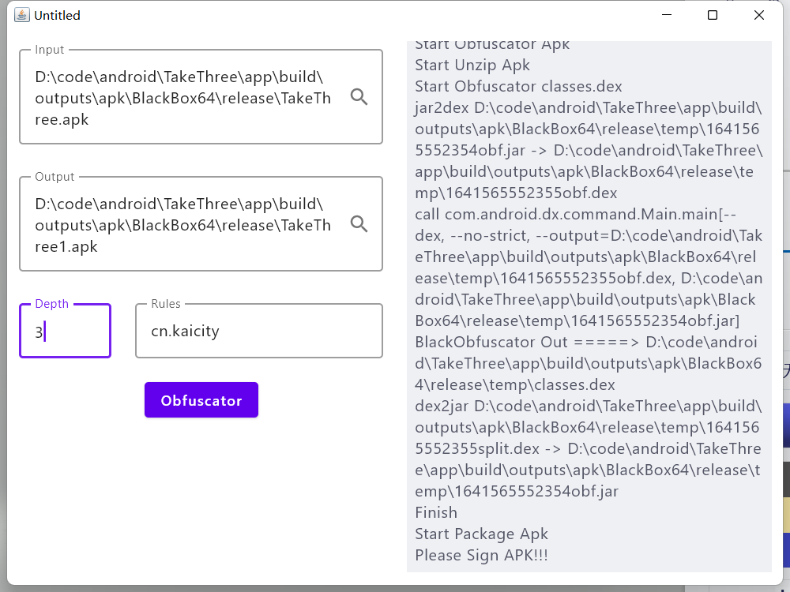

# BlackObfuscator-GUI

> BlackObfuscator GUI 工具

#### 环境说明
1. JDK11或以上
2. 前往BlackObfuscator的Release界面下载打包好的工具
3. 解压到jar同级目录，并重命名为dex-tools
>dex-tools
> > lib
>
> > bin
>
> BlackObfuscator.jar

#### 运行说明
1. 可直接双击clickme.bat(Windows)或者clickme.sh(Macos/Linux)
2. 可对照BlackObfuscator的参数说明

#### 参数说明
1. Input 要混淆的apk或者dex的路径，可点击右侧图标跳转选择
2. Output 输出保存的apk或者dex的路径，可点击右侧图标跳转选择
3. Depth 混淆深度
4. Rules 要混淆的包名，可换行输入多行

#### 运行效果

